# Projeto da disciplina Engenharia de Machine Learning [25E1_3]

## Questão 1

Aluno: Kleber Giovelli Abitante

Repositório: https://github.com/kleberga/proj_eng_machine_learning_3

## Questão 2

A figura abaixo mostra os arquivos originais (baixados do site) na pasta *01_raw* do projeto:

**Figura 1** - Arquivos na pasta *01_raw*.

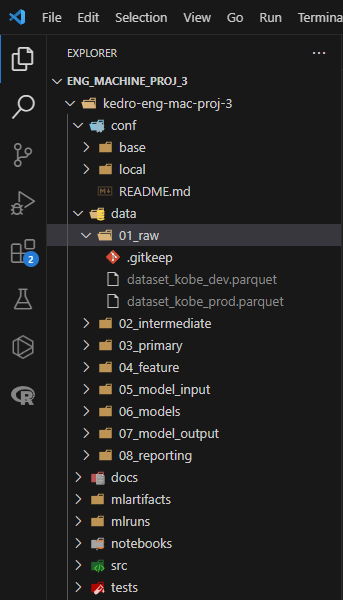

A imagem a seguir mostra as etapas necessárias para conclusão deste projeto.

**Figura 2** - Diagrama das etapas necessárias para o projeto.

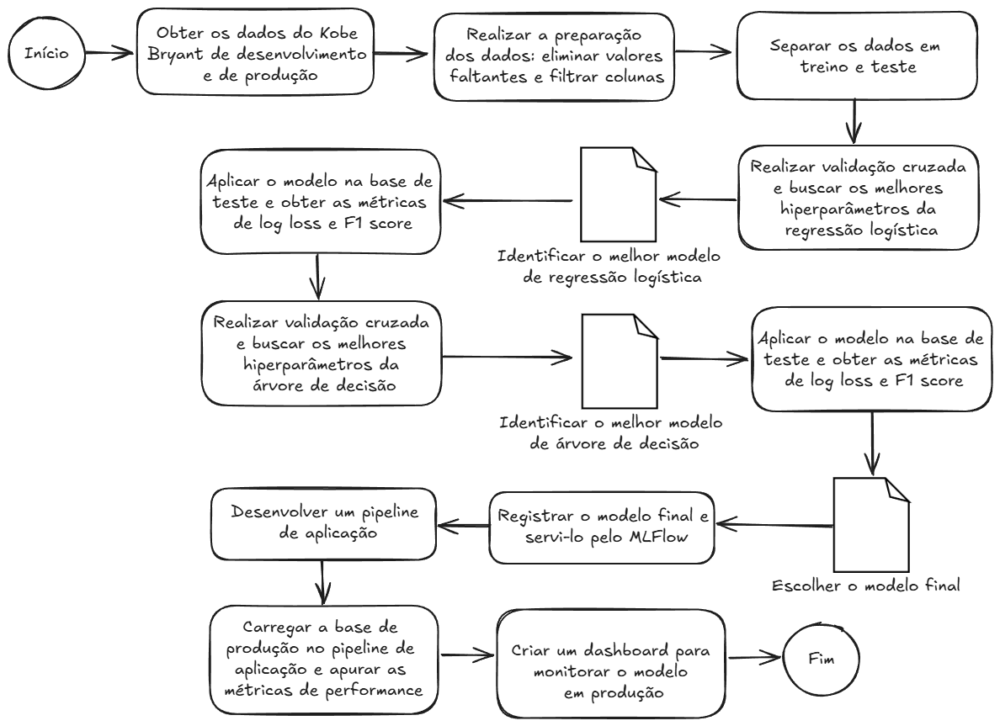

## Questão 3

- **Streamlit**: é uma ferramenta para construir aplicações baseadas na web para machine learning e ciência de dados. Ela permite criar dashboards interativos, utilizar outras bibliotecas, como Matplotlib, para visualizar os dados e adicionar botões e menus que permitam ao usuário interagir com a aplicação. Além disso, a aplicação pode auxiliar a monitorar e gerenciar a saúde dos modelos;
- **MLFlow**: permite o rastreamento de experimentos de machine learning, registro e controle de versões dos modelos e provisionamento (deployment) em plataformas na nuvem, em contêineres Docker ou em REST APIs;
- **PyCaret**: é uma biblioteca que possui funções que automatizam o pré-processamento, treinamento e avaliação de modelos de machine learning. Ela permite buscar os melhores hiperparâmetros e comparar modelos de forma fácil e com a utilização de poucas funções. Pode ser utilizada também na atualização de modelos; e
- **Scikit-Learn**: é uma ferramenta que possui funções para criação e implementação de modelos de machine learning. Permite pré-processamento de dados, busca pelos melhores hiperparâmetros, seleção de features, treinamento, avaliação e atualização de modelos.  

## Questão 4

Os artefatos que serão criados no projeto são:

- **diagrama_2.png**: diagrama contendo todas as etapas necessárias do projeto;
- **dataset_kobe_dev.parquet**: base de dados, que contém os arremessos de Kobe Bryant, a ser utilizada para desenvolvimento dos modelos. A base contém 25 colunas e 24.271 linhas. As colunas da base de dados são (a definição consta neste site https://www.kaggle.com/competitions/kobe-bryant-shot-selection/discussion/20888):
  1. *action_type*: tipos de arremessos, de forma mais detalhada, totalizado 57 diferentes tipos;
  2. *combined_shot_type*: tipos de arremessos, de forma mais geral, totalizado 6 diferentes tipos;
  3. *game_event_id*: identificador único de cada evento;
  4. *game_id*: identificador único de cada jogo (não é informada a diferença em relação à variável *game_event_id*);
  5. *lat*: latitude do estádio em que o jogo foi realizado;
  6. *lon*: longitude do estádio em que o jogo foi realizado;
  7. *loc_x*: localização do arremesso no eixo-x (-250 = canto inferior direito da quadra até 250 = canto superior direito da quadra, em que a cesta está no centro direito);
  8. *loc_y*: localização do arremesso no eixo-y (-40 = lado direito até 900 = lado esquerdo, em que a cesta está no centro direito);
  9. *minutes_remaining*: minutos faltando para terminar um período do jogo (máximo de 12);
  10. *period*: período do jogo (em geral, há no máximo 4, mas em caso de empate, ocorrerão períodos adicionais);
  11. *playoffs*: marcação se o jogo não ocorreu nos playoffs (0) ou ocorreu em playoffs (1);
  12. *season*: anos nos quais ocorreu a temporada da NBA;
  13. *seconds_remaining*: segundos faltando em um período;
  14. *shot_distance*: distância (em metros) do arremesso em relação à cesta;
  15. *shot_type*: pontos que poderiam ser obtidos no arremesso (2 ou 3 pontos);
  16. *shot_zone_area*: área da quadra de basquete de onde o arremesso foi executado (BC, C, LC, L, RC, R);
  17. *shot_zone_basic*: zona da quadra de basquete de onde o arremesso foi executado (7 diferentes áreas);
  18. *shot_zone_range*: intervalo (em metros) do arremesso em relação à cesta (<8, 8-16, 16-24, 24+, fundo da quadra);
  19. *team_id*: código identificador do time de Kobe Bryant (Los Angeles Lakers - LA) (mesmo código em toda a base de dados);
  20. *team_name*: nome do time (LA) (mesmo nome em toda a base de dados);
  21. *game_date*: data em que o jogo ocorreu
  22. *matchup*: equipes que disputaram a partida (LA versus outra equipe);
  23. *opponent*: equipe adversária de LA na partida;
  24. *shot_made_flag*: marcação se o arremesso teve sucesso (1) ou não (0); e
  25. *shot_id*: identificador único de cada arremesso.
- **dataset_kobe_prod.parquet**: base de dados, que contém os arremessos de Kobe Bryant, a ser utilizada com o modelo final no ambiente de produção. A base contém 25 colunas e 6.426 linhas. As colunas da base de dados são as mesmas da base anterior;
- **df_explorado_dev.xlsx**: base de dados contendo os nomes das colunas, o tipo de cada coluna, a quantidade valores faltantes em cada coluna e o número total de observações de cada coluna da base de desenvolvimento de modelos;
- **df_explorado_prod.xlsx**: base de dados contendo os nomes das colunas, o tipo de cada coluna, a quantidade valores faltantes em cada coluna e o número total de observações de cada coluna da base a ser utilizada com o modelo final no ambiente de produção;
- **data_filtered_dev.parquet**: base de dados com exclusão das linhas com valores faltantes e contendo apenas as colunas a serem utilizadas no treinamento dos modelos. A base contém 7 colunas e 20.285 linhas. As colunas são:
  1. *lat*;
  2. *lon*;
  3. *minutes_remaining*;
  4. *period*;
  5. *playoffs*;
  6. *shot_distance*; e
  7. *shot_made_flag*.
- **data_filtered_prod.parquet**: base de dados com exclusão das linhas com valores faltantes e contendo apenas as colunas a serem utilizadas com o modelo final no ambiente de produção. A base contém 7 colunas e 5.412 linhas. As colunas são as mesmas da base anterior.
- **base_test.parquet**: representa 20% dos dados da base "data_filtered_dev.parquet", a ser usada para testar os modelos. A divisão foi realizada de modo aleatório e com estratificação pela variável *shot_made_flag*;
- **base_train.parquet**: representa 80% dos dados da base "data_filtered_dev.parquet", a ser usada para treinar os modelos. A divisão foi realizada de modo aleatório e com estratificação pela variável *shot_made_flag*;
- **model_dt.pkl**: modelo de árvore de decisão criado com a base de treinamento. O modelo é salvo com controle de versão;
- **model_lr.pkl**: modelo de regressão logística criado com a base de treinamento. O modelo é salvo com controle de versão;
- **modelo final registrado**: modelo final registrado no MLFlow, escolhido com base nas melhores métricas de performance;
- **pipeline de aplicação**: pipeline para provisionamento do modelo final escolhido para ser aplicado na base de produção;
- **predictions.parquet**: base de dados contendo as projeções realizadas pelo modelo final (registrado no MLFlow) utilizando como input os dados de produção; e
- **dashboard**: dashboard para monitorar o modelo em produção.

## Questão 5

Antes de inicializar o MLFlow server, foi criada uma variável de ambiente no Windows, conforme a imagem abaixo.

**Figura 3** - Variável de ambiente do MLFlow.

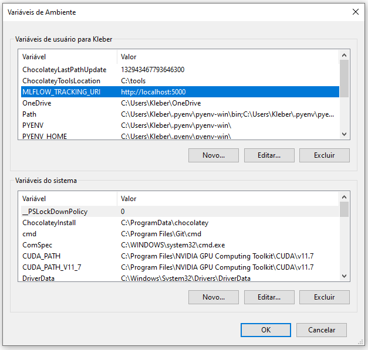

A imagem abaixo mostra o pipeline do MLFlow com o nome "PreparacaoDados" para a base de desenvolvimento. Este pipeline remove os valores faltantes e filtra apenas as variáveis a serem utilizadas nos modelos. A versão do Python utilizada foi a 3.11.9. A base filtrada de desenvolvimento possui 7 colunas e 20.285 linhas.

**Figura 4** - Imagem do pipeline de processamento de dados com o MLFlow, rodada (run) com o nome "PreparacaoDados" para manipulação da base de desenvolvimento.

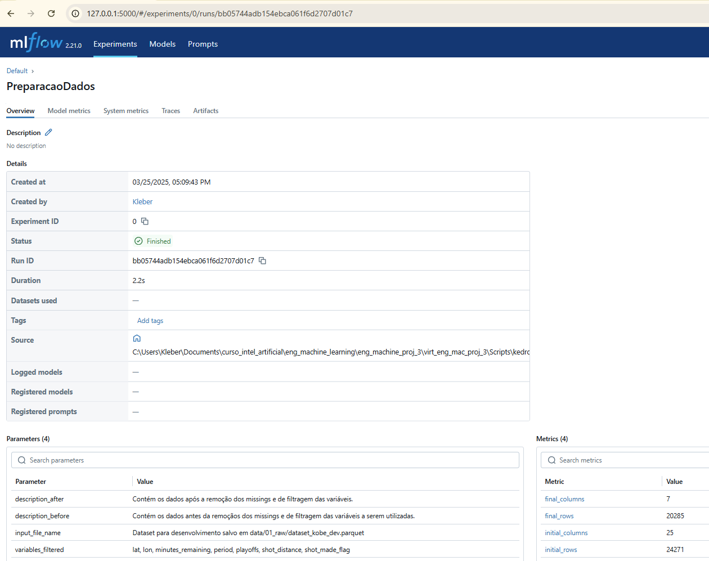

A imagem a seguir mostra o pipeline do MLFlow com o nome "PreparacaoDados" para a base de produção, o qual também remove os valores faltantes e filtra apenas as variáveis a serem utilizadas nos modelos. A base filtrada de produção possui 7 colunas e 5.412 linhas.

**Figura 5** - Imagem do pipeline de processamento de dados com o MLFlow, rodada (run) com o nome "PreparacaoDados" para manipulação da base de produção.

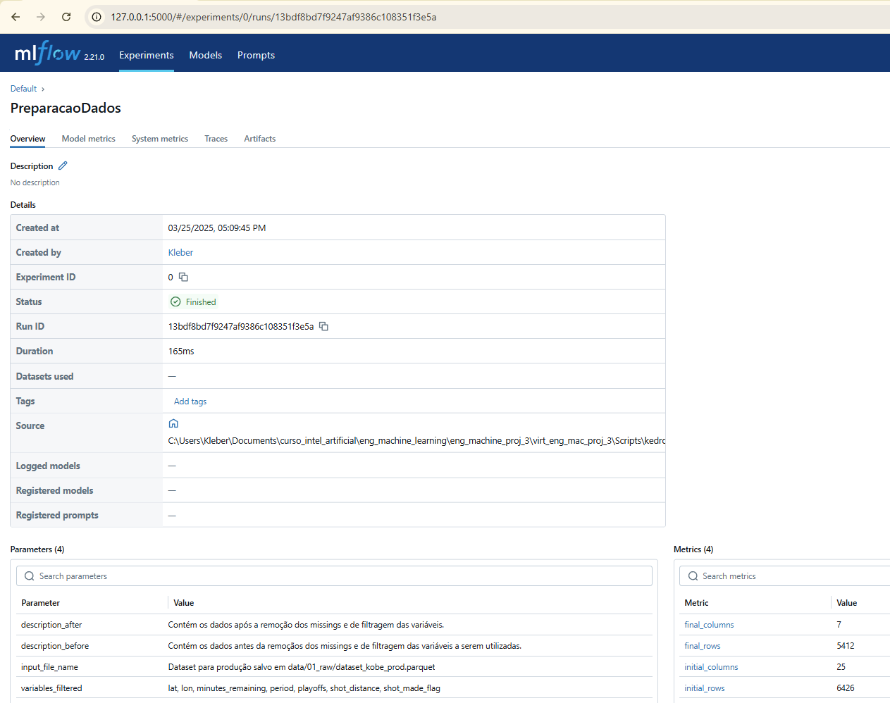

A imagem a seguir mostra os arquivos filtrados e com eliminação de valores faltantes salvos na pasta *02_intermediate*.

**Figura 6** - Imagem dos arquivos filtrados.

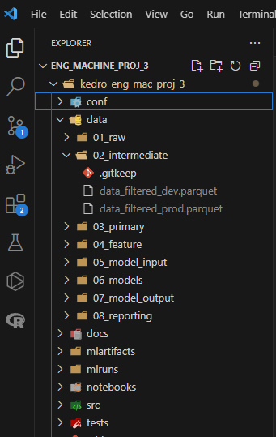

A imagem a seguir mostra o pipeline do MLFlow com o nome "PreparacaoDados" para separar as bases em treinamento (80% dos dados da base filtrada) e teste (20% da base filtrada). A separação ocorreu de forma aleatória e com estratificação pela variável *shot_made_flag*.

**Figura 7** - Imagem do pipeline de processamento de dados com o MLFlow, rodada (run) com o nome "PreparacaoDados" para separar a base em treinamento e teste.

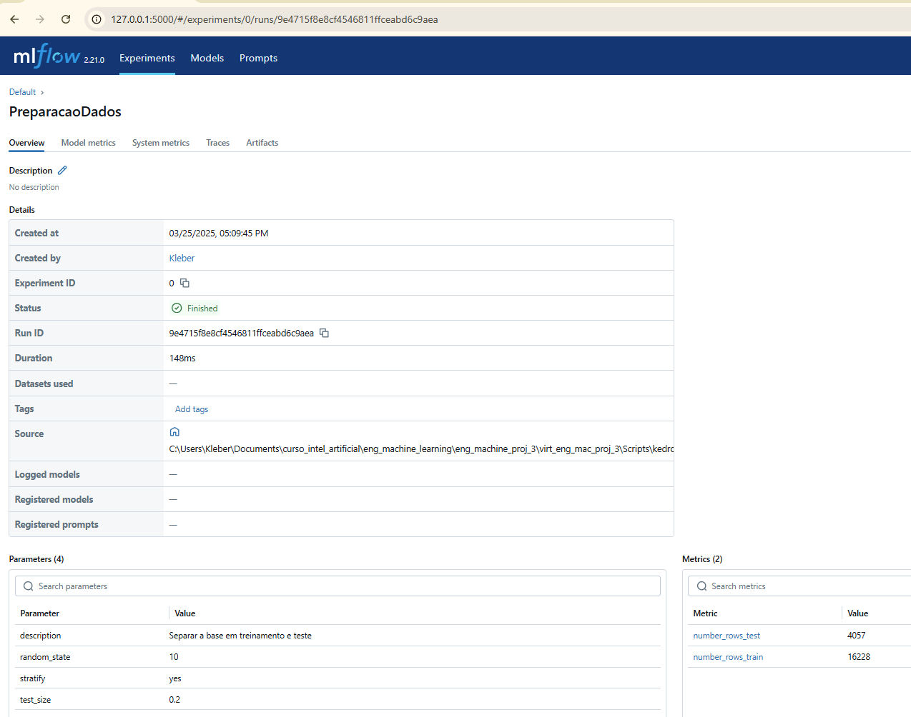

A imagem a seguir mostra os arquivos de treinamento e de teste, após a separação em 80% para treinamento e o restante para teste.

**Figura 8** - Base de treinamento e de teste após a separação.

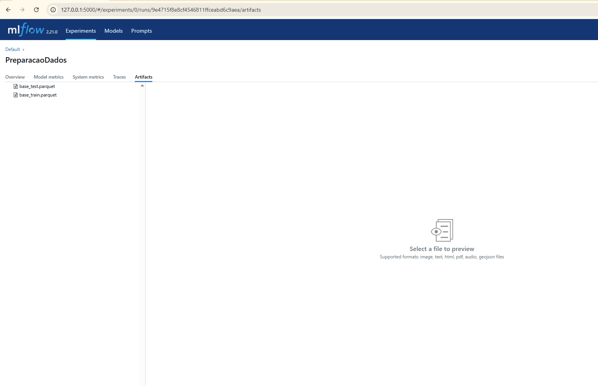

## Questão 6

A imagem a seguir apresentar o pipeline do MLFlow com o nome "Treinamento" do modelo de árvore de decisão. Os valores calculados de *log loss* e *F1 score* para o melhor modelo escolhido, utilizando os dados de teste, foram 16,14 e 0,548, respectivamente.

**Figura 9** - Imagem do pipeline de processamento de dados com o MLFlow, rodada (run) com o nome "Treinamento" do modelo de árvore de decisão.

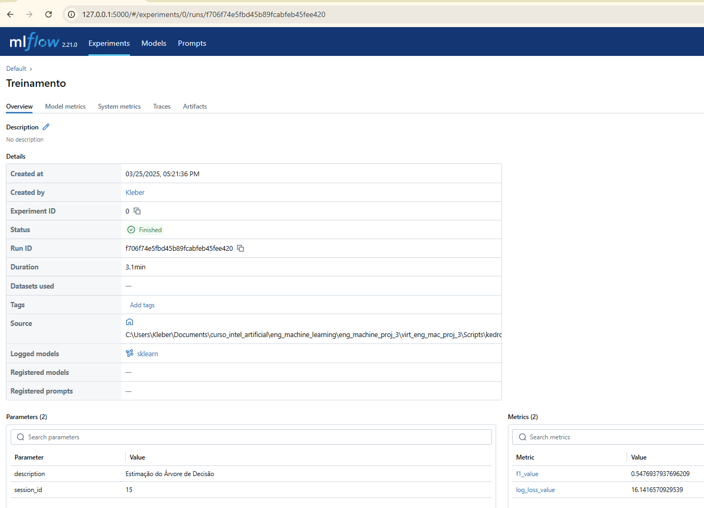

A próxima imagem mostra o artefato referente ao modelo de árvore de decisão.

**Figura 10** - Artefato do modelo de árvore de decisão:

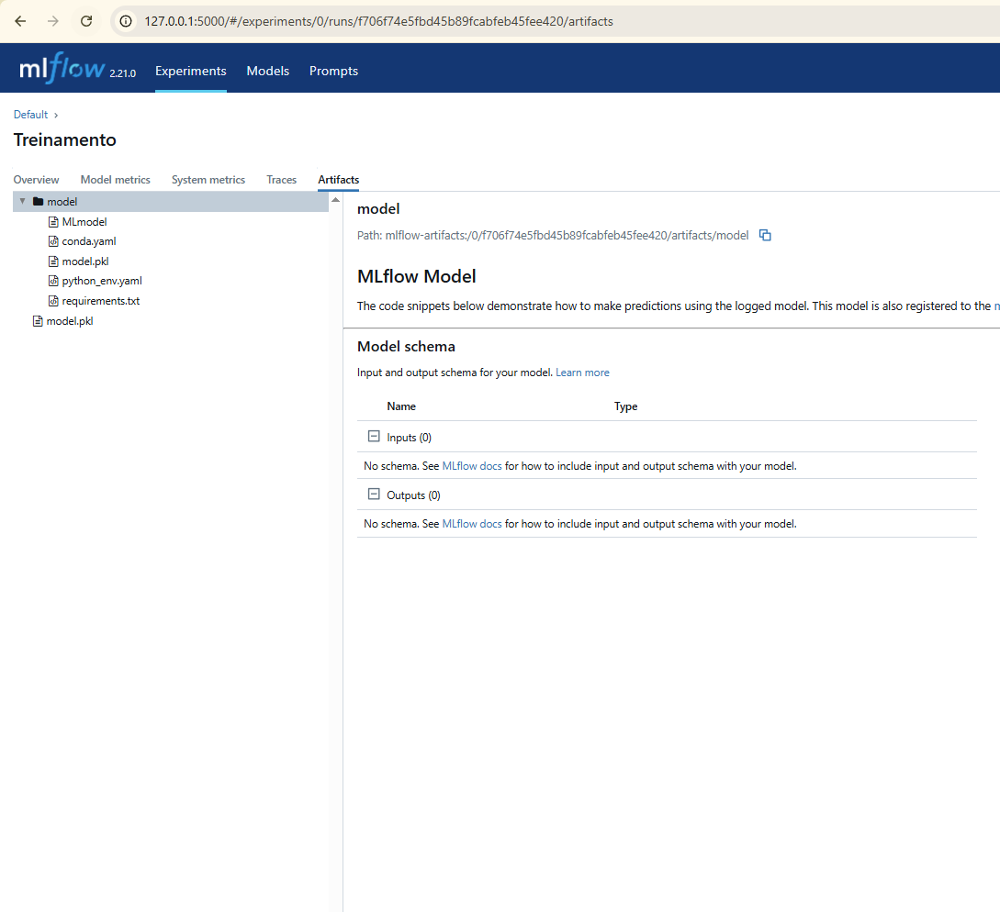

A imagem a seguir apresenta o pipeline do MLFlow com o nome "Treinamento" do modelo de regressão logística. Os valores de *log loss* e *F1 score* obtidos pelo melhor modelo escolhido, utilizando a base de teste, foram 0,71 e 0,552, respectivamente.

**Figura 11** - Imagem do pipeline de processamento de dados com o MLFlow, rodada (run) com o nome "Treinamento" do modelo de regressão logística.

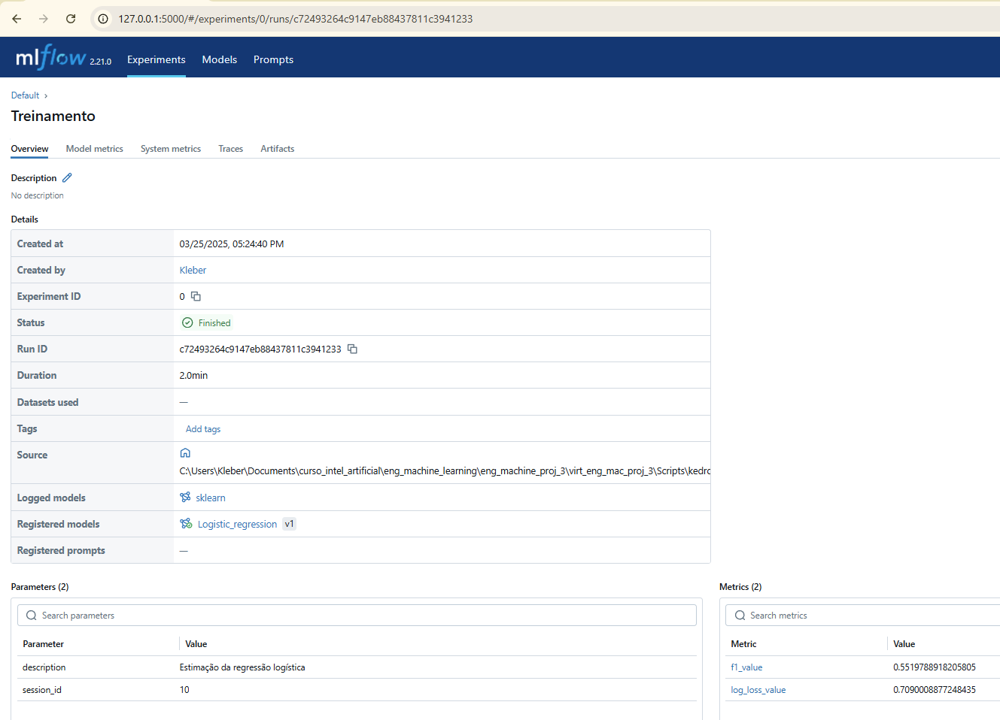

A imagem a seguir mostra o artefato da regressão logística.

**Figura 12** - Artefato do modelo de regressão logística.

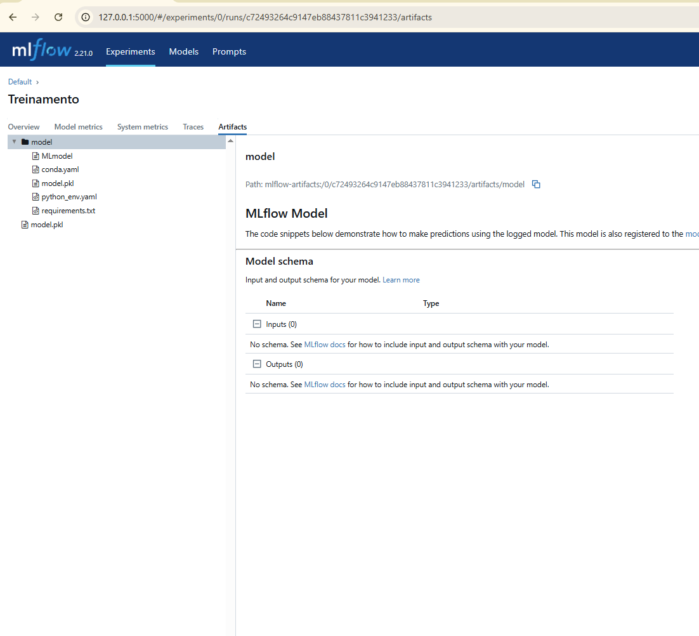

A imagem a seguir mostra os modelos salvos na pasta *06_models*.

**Figura 13** - Modelos salvos.

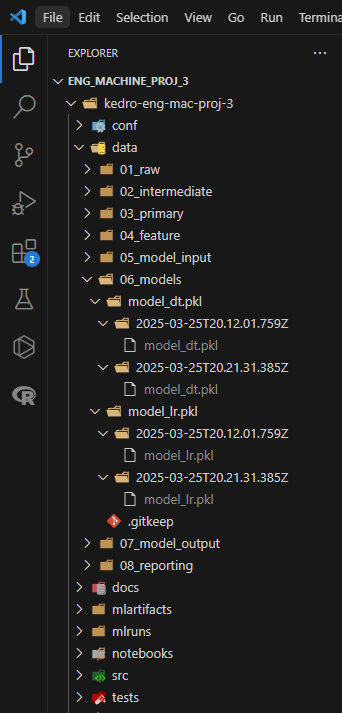

O modelo escolhido para finalização foi a **regressão logística**, pois apresentou o maior valor de *F1 score* e o menor valor de *log loss*, em relação à árvore de decisão.

## Questão 7

A imagem a seguir mostra a inicialização do MLFlow server.

**Figura 14** - Inicialização do MLFlow server.

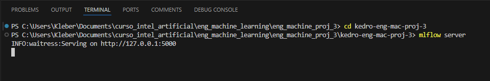

A próxima imagem mostra a inicialização da API local do modelo escolhido ("regressão logística") usando o MLFlow. O comando executado no terminal foi o seguinte:

**mlflow models serve -m runs:/c72493264c9147eb88437811c3941233/model -p 5001**

**Figura 15** - Inicialização da API do modelo escolhido usando o MLFlow.

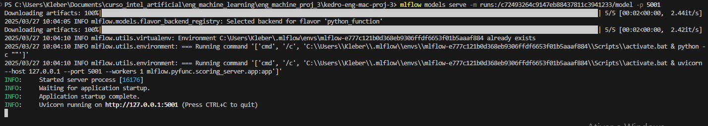

A imagem a seguir mostra o registro da execução do PipelineAplicação no MLFlow. Os valores obtidos de *log loss* e *F1 score* foram 0,892 e 0, respectivamente.

**Figura 16** - PipelineAplicação no MLFlow.

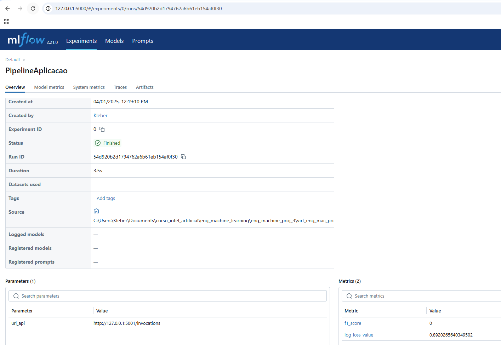

A imagem a seguir mostra o registro do artefato gerado pelo PipelineAplicação no MLFlow, o qual contém as projeções geradas a partir da base de produção.

**Figura 17** - Artefato do PipelineAplicação no MLFlow.

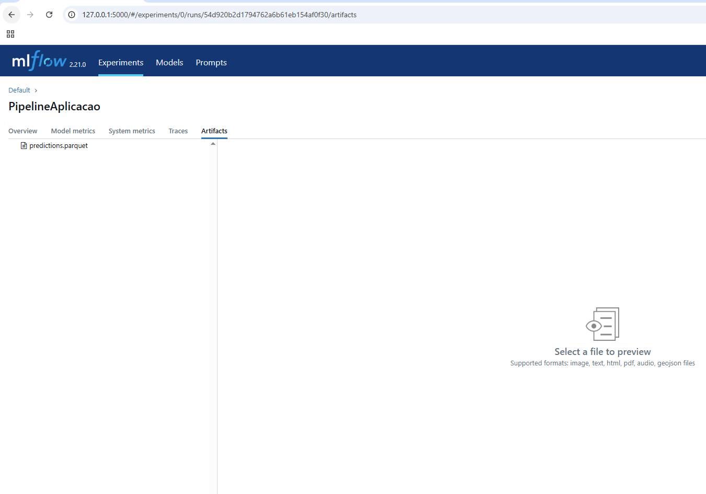

### a)
O modelo não é aderente a essa nova base, pois o valor do *F1 score* foi zero. Este resultado é decorrente da diferença de distribuição que os dados de produção e desenvolvimento possuem em algumas variáveis. O modelo foi treinado utilizando-se apenas os dados de desenvolvimento. Se a distribuição das variáveis fosse similar nas duas bases, era de se esperar que o modelo apresentasse performance similar àquela apresentada com o dados de desenvolvimento. Porém, algumas variáveis possuem distribuições que aparentam ser significativamente diferentes entre as duas bases. A figura a seguir compara os histogramas da variável *lon* na base de desenvolvimento (imagem à esquerda) e na base de produção (imagem à direita). Percebe que na base de desenvolvimento, o valor da variável parece se concentrar em torno dos valores -118.3 e -118.2, com o formato de uma distribuição Normal. Já na base de produção, os valores se concentram entre -118.5 e -118.4 e também entre -118.1 e -118.0, em uma distribuição com característica bimodal, que não se assemelha à distribuição Normal.

**Figura 18** - Histogramas da variável *lon* nas bases de desenvolvimento e de produção. 

  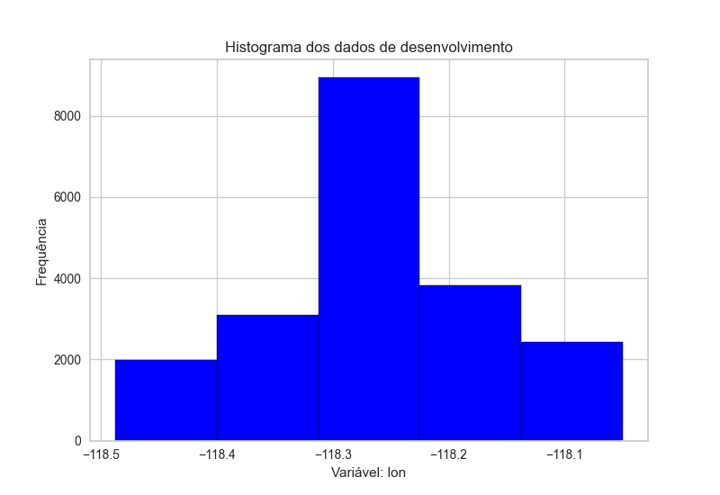
  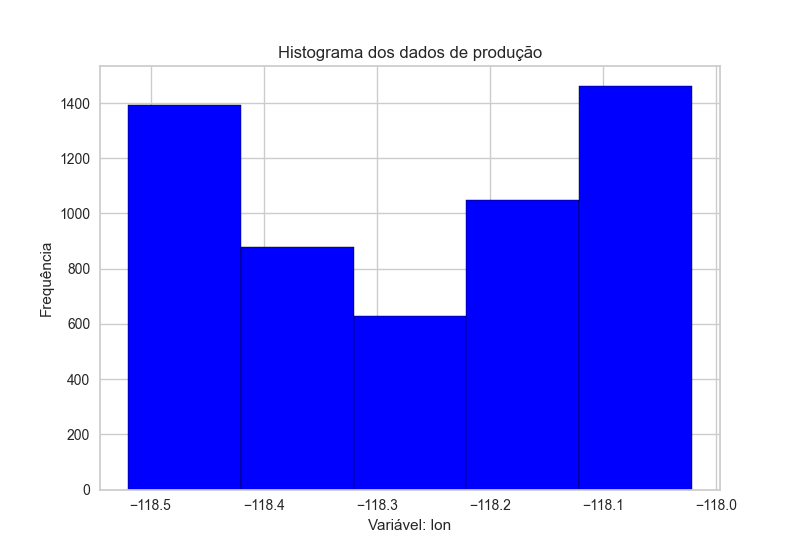

As diferenças significativas nas distribuições entre os dados de desenvolvimento e de produção ocorrem também nas variáveis *minutes_remaining*, *period*, *shot_distance* e *shot_made_flag*, conforme pode ser observado na figura abaixo.

**Figura 19** - Histogramas das variáveis *minutes_remaining*, *period*, *shot_distance* e *shot_made_flag* nas bases de desenvolvimento e de produção.

  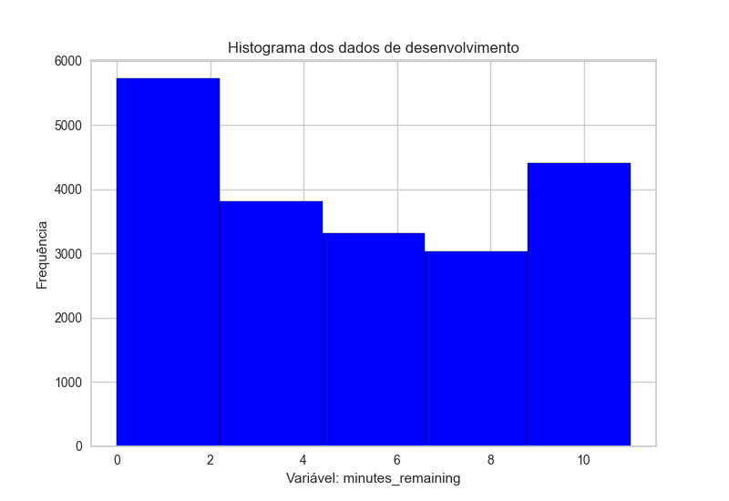
  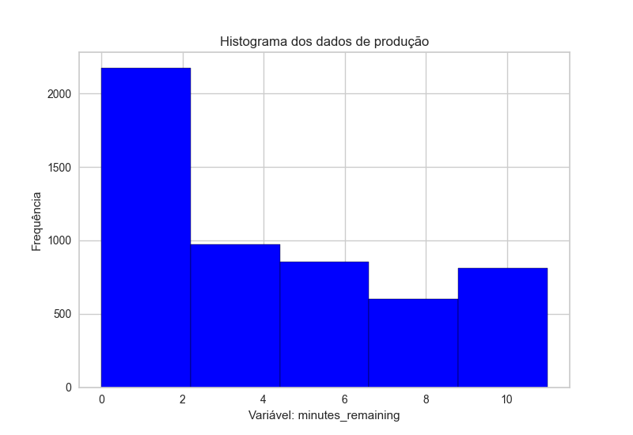

  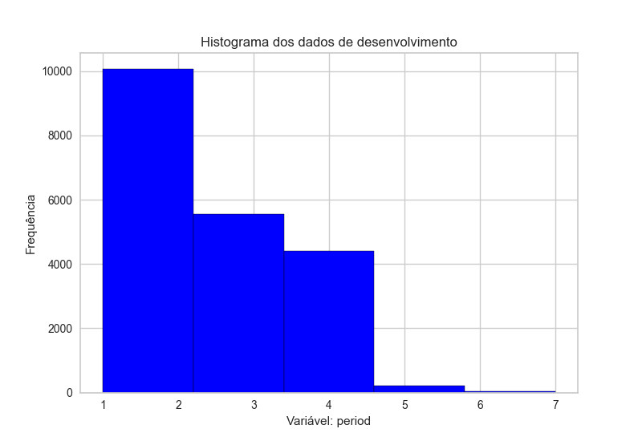
  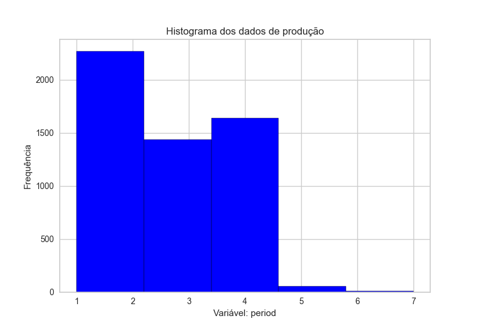

  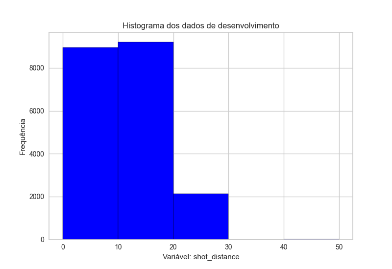
  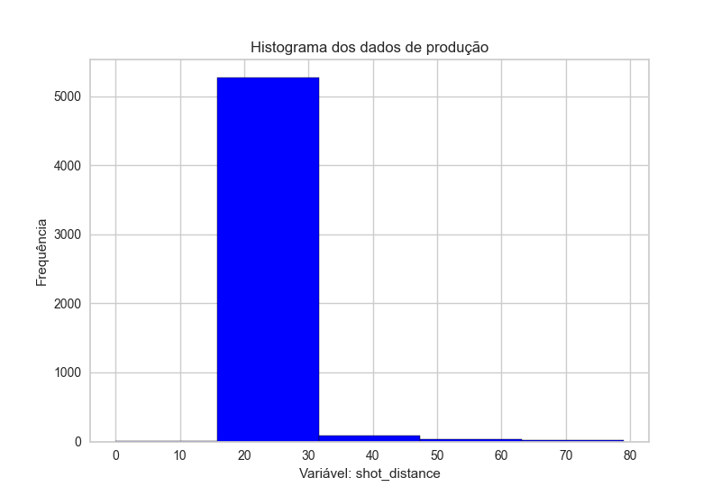

  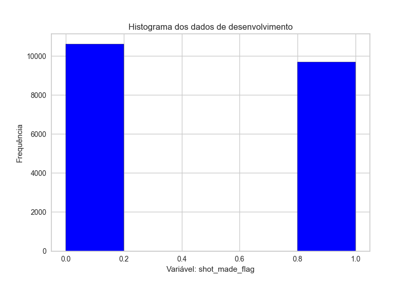
  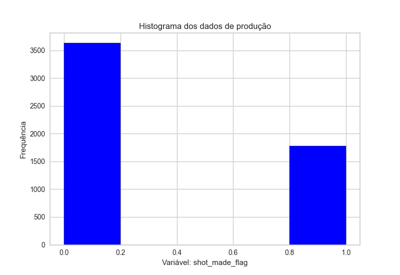

Nesta situação, entendo-se que as distribuições das variáveis sofreram de fato alterações (não se trata de erro de mensuração), deveria ocorrer um novo processo de busca por um modelo adequado, desta vez utilizando-se apenas os dados de produção, pois os dados de desenvolvimento não refletem mais, de forma adequada, a população que originou aqueles dados.

### b)

Quando a variável de resposta está disponível, a avaliação do modelo em operação pode ser feita a seguinte forma:
1. Utilizando métricas de performance. Para modelos de classificação, podem ser utilizadas as métricas como *accuracy*, *recall*, *precision*, *F1-score* e área sob a curva ROC. Para modelos de regressão, podem ser utilizadas as métricas de Erro Absoluto Médio, Erro Quadrático Médio e R-quadrado;
2. Monitorar a ocorrência de *concept drif* comparando os *inputs* e as projeções;
3. Identificar erros, quando as projeções se distanciaram muito dos *inputs*; e
4. Atualizar o modelo periodicamente com novos dados, a fim de mantê-lo atualizado.

Quando a variável de resposta não está disponível, podem ser utilizadas as seguintes medidas:
1. Verificar a qualidade dos *inputs*;
2. Comparar as projeções do modelo com benchmarks disponíveis no mercado;
3. Detectar *outliers* nos dados de *input*, a fim de assegurar que o modelo não está exposto a dados muito discrepantes daqueles usados em seu treinamento;
4. Realizar *A/B Testing*, que consiste que em comparar as projeções do modelo com aquelas geradas por outro modelo mais simples; e
5. Receber *feedback* dos usuários.

### c)

A estratégia reativa de retreinamento do modelo em operação consiste em atualizar o modelo em resposta a uma redução observável na performance do modelo ou a mudanças nos dados. O processo consiste em coletar novos dados, combinar os mesmos com os dados históricos, retreinar o modelo e validar o seu desempenho em relação ao modelo anterior. A vantagem dessa abordagem é garantir que o retreinamento irá ocorrer somente quando necessário, reduzindo custos computacionais. Por outro lado, a desvantagem é que, durante o intervalo de tempo entre a perda de performance do modelo e sua melhoria, o modelo irá gerar resultados de baixa qualidade.

A estratégia preditiva de retreinamento do modelo, por sua vez, consiste em atualizar o modelo proativamente, se antecipando a mudanças nos dados ou requisitos operacionais. O processo consiste em criar um pipeline que automaticamente coleta novos dados e retreina o modelo periodicamente. A vantagem desta abordagem é a antecipação em relação a possíveis problemas que possam prejudicar a performance do modelo. A desvantagem é que retreinar o modelo em intervalos fixos de tempo pode significar uso desnecessário de recursos computacionais, pois o retreinamento ocorrerá para um modelo que está com performance adequada.
